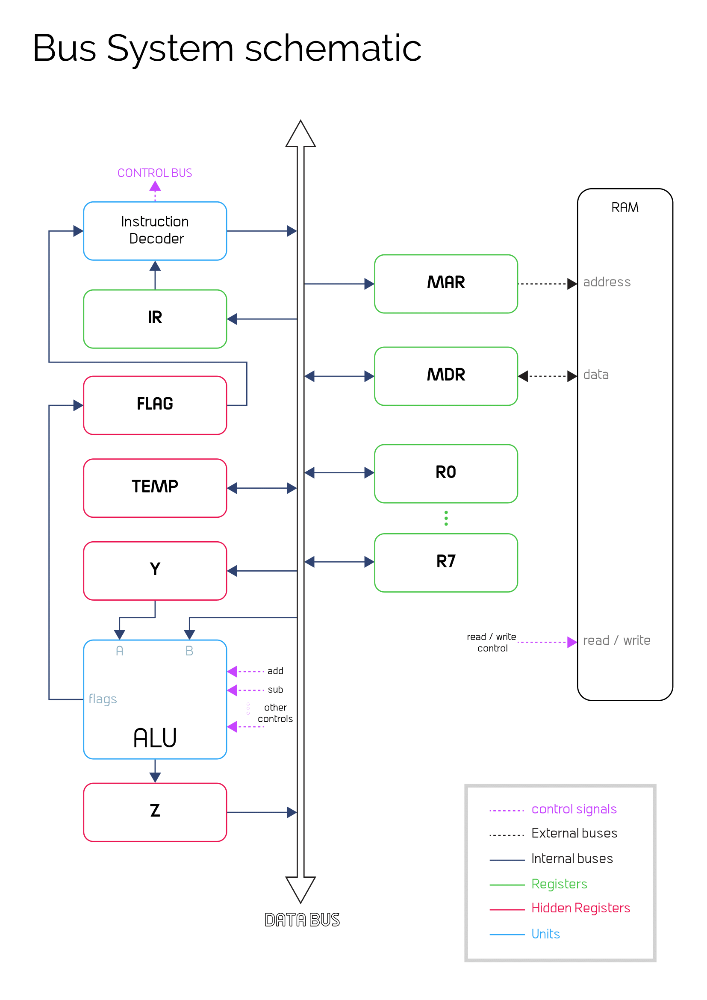
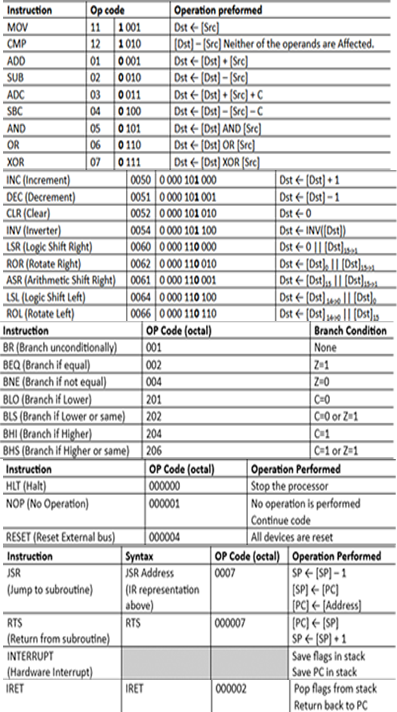

# PDP-11
PDP11-based microprocessor with its assembler.

# Design
<p align="center">
  

  
</p>

## Addressing modes

- Register Direct : `Mov R1, R2`
- Auto Increment : `Mov (R1)+, R2`
- Auto Decrement : `Mov -(R1), R2`
- Indexed : `Mov X(R1), R2`
- Register Indirect : `Mov @R1, R2`
- Auto Increment Indirect : `Mov @(R1)+, R2`
- Auto Decrement Indirect : `Mov @-(R1), R2`
- Indexed Indirect : `Mov @X(R1), R2`


### Installation

1. **Clone the repository**

```sh
$ git clone https://github.com/fuboki10/PDP-11
```
2. **Navigate to repository directory**
```sh
$ cd PDP-11
```

# Assembler

[Assembler](src/assembler/main.cpp)  

```sh
$ g++ main.cpp -o assembler.out

$ ./assembler.out <CodeFile>
```

- **example** : 
  - `./assembler.out test.txt`

- **output** : 
  - `memory.mem`


# Contributers:

<table>
  <tr>
    <td align="center"><a href="https://github.com/fuboki10"><br /><sub><b>Abdelrahman Tarek</b></sub></a><br /></td>
    <td align="center"><a href="https://github.com/Hassan950"><br /><sub><b>Hassan Mohamed</b></sub></a><br /></td>
    <td align="center"><a href="https://github.com/D4rk1n"><br /><sub><b>Abdelrahman Arafat</b></sub></a><br /></td>
  </tr>
 </table>
